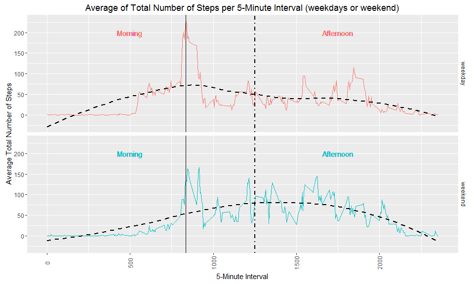

# Reproducible Research: Fitness Data

The following report examines a set of data related to personal activity,
collected through activity monitoring devices such as [Fitbit](http://www.fitbit.com), [Nike Fuelband](http://www.nike.com/us/en_us/c/nikeplus-fuelband) or [Jawbone Up](https://jawbone.com/up).

The data consists in 2 months (October and November 2012) of personal data collected from an anonymous individual at 5 minute intervals throughout each day. They include the number of steps taken at 5 minutes intervals each day.

## Loading and preprocessing the data

We first load the dataset and examine a few first rows:


```r
data <- read.csv(unzip("../data/activity.zip"))
head(data)
```

```
##   steps       date interval
## 1    NA 2012-10-01        0
## 2    NA 2012-10-01        5
## 3    NA 2012-10-01       10
## 4    NA 2012-10-01       15
## 5    NA 2012-10-01       20
## 6    NA 2012-10-01       25
```

```r
file.remove("activity.csv")
```

```
## [1] TRUE
```

The data frame `data` is our original data set. The observed variables are the following:

* __steps:__ Number of steps taking in a 5-minute interval (missing values are recorded as `NA`)
* __date:__ The date on which the measurement was taken (format is `YYYY-MM-DD`)
* __interval:__ Identifier for the 5-minute interval in which measurement was taken

At first, we won't take the missing values in account for our analysis, so we will remove them


```r
clean <- data[complete.cases(data),]
head(clean)
```

```
##     steps       date interval
## 289     0 2012-10-02        0
## 290     0 2012-10-02        5
## 291     0 2012-10-02       10
## 292     0 2012-10-02       15
## 293     0 2012-10-02       20
## 294     0 2012-10-02       25
```

Now, we can proceed with the analysis.

## What is mean total number of steps taken per day?

We will first realize a summarization of the data by summing the steps with respect to the day:


```r
agg <- aggregate(clean$steps, by = list(time = clean$date), FUN = sum)
head(agg)
```

```
##         time     x
## 1 2012-10-02   126
## 2 2012-10-03 11352
## 3 2012-10-04 12116
## 4 2012-10-05 13294
## 5 2012-10-06 15420
## 6 2012-10-07 11015
```

We have created a new dataframe with the variable `time` being the date of the day and `x` being the sum of all the steps taken during this very day.

To plot, we will use the library **ggplot2**, so please make sure it is installed on your system (you can use the command `install.packages("ggplot2")`).


```r
library(ggplot2)
```

We will now create a general view of this dataframe with a histogram:


```r
ggplot(agg, aes(time, x)) +
  geom_bar(stat = "identity", fill = "blue", alpha = 0.5, width = 0.6) +
  theme(axis.text.x = element_text(angle = 90, vjust = 0.5)) +
  geom_text(aes(label = x, y = 10000), angle = 90, vjust = 0.4) +
  labs(x = "day (YYYY-MM-DD)", y = "Total number of steps") +
  ggtitle("Total Number of Steps per Day")
```

<!-- -->

In the next code chunk, we will calculate both the mean and the median of the steps taken during those 2 months:


```r
activity.mn <- round(mean(agg$x), 2)
activity.md <- median(agg$x)
```

This yields the following values:

* __Mean:__ 1.076619\times 10^{4}
* __Median:__ 10765

We can see both values are actually very close, which means most of the activity is centered around the median and there isn't much skewness in the data (at least at first sight).

We can add an new plot with the mean represented as an horizontal line:


```r
ggplot(agg, aes(time, x)) +
  geom_bar(stat = "identity", fill = "blue", alpha = 0.5, width = 0.6) +
  theme(axis.text.x = element_text(angle = 90, vjust = 0.5)) +
  geom_hline(aes(yintercept = activity.mn), linetype = "dashed") +
  geom_text(aes(x = agg$time[25], y = activity.mn + 1000, label = paste("Mean:", activity.mn))) +
  labs(x = "day (YYYY-MM-DD)", y = "Total number of steps") +
  ggtitle("Total Number of Steps per Day")
```

<!-- -->

## What is the average daily activity pattern?

We will now perform a time series analysis, trying to determin which moment of the day yields the peak activity. For this, we will prepare a new dataset from the clean one, summarizing the steps with respect to the interval:


```r
aggmn <- aggregate(clean$steps, by = list(moment = clean$interval), FUN = mean)
head(aggmn)
```

```
##   moment         x
## 1      0 1.7169811
## 2      5 0.3396226
## 3     10 0.1320755
## 4     15 0.1509434
## 5     20 0.0754717
## 6     25 2.0943396
```

This created a new set of data, with the `moment` variable being the 5-minute interval identifier and the `x` variable being the mean of the steps taken at this interval across all days.

The next graph will plot the variable `x` against `moment`:


```r
ggplot(aggmn, aes(moment, x)) +
  geom_line() +
  theme(axis.text.x = element_text(angle = 90, vjust = 0.5)) +
  labs(x = "5-minute interval", y = "Average number of steps taken") +
  ggtitle("Average Number of Steps Taken Across All Days per 5-minute Interval")
```

<!-- -->

We can clearly see a peak within the interval `750 < x < 1000`. We can compute the max from the dataset:


```r
activity.mx <- aggmn[aggmn$x == max(aggmn$x), 1]
```

This yields the value **835**, which is the peak activity 5-minute interval in average.

## Inputing missing values

Now, we will have a look to the influence the missing values `NA` can have on the results. First, we will try to count how many missing values there are in the original dataset `data`.

We will start by identifying which variable in the original dataset yields some missing values `NA`:

* The variable __steps__ has some missing values: TRUE
* The variable __date__ has some missing values: FALSE
* The variable __interval__ has some missing values: FALSE

According to the results, we will therefore calculate how many missing values there are in the vector `data$steps`:


```r
stepsNA <- sum(is.na(data$steps)) 
```

This yields a total of **2304** missing values.

Following a simple strategy, we will fill in the missing data: all `NA` will be replaced by the average value across all day for the corresponding 5-minute interval (rounded to 2 decimal):


```r
filled <- data
filled$steps <- sapply(as.numeric(rownames(filled)), function(i){
  if (is.na(filled[i, "steps"])) {
    as.integer(aggmn[aggmn$moment == filled[i, "interval"], "x"])
  }
  else {
    as.integer(filled[i, "steps"])
  }
})
head(filled)
```

```
##   steps       date interval
## 1     1 2012-10-01        0
## 2     0 2012-10-01        5
## 3     0 2012-10-01       10
## 4     0 2012-10-01       15
## 5     0 2012-10-01       20
## 6     2 2012-10-01       25
```

We can now create a new aggregate that sums the steps with respect to the day:


```r
aggna <- aggregate(filled$steps, by = list(time = filled$date), FUN = sum)
head(aggna)
```

```
##         time     x
## 1 2012-10-01 10641
## 2 2012-10-02   126
## 3 2012-10-03 11352
## 4 2012-10-04 12116
## 5 2012-10-05 13294
## 6 2012-10-06 15420
```

And redo the histogram:


```r
ggplot(aggna, aes(time, x)) +
  geom_bar(stat = "identity", fill = "blue", alpha = 0.5, width = 0.6) +
  theme(axis.text.x = element_text(angle = 90, vjust = 0.5)) +
  geom_text(aes(label = x, y = 10000), angle = 90, vjust = 0.4) +
  labs(x = "day (YYYY-MM-DD)", y = "Total number of steps") +
  ggtitle("Total Number of Steps per Day")
```

<!-- -->

Then, we can evaluate again the mean and median of the steps taken during those 2 months. This way, we can estimate how filling the missing values has influenced the results:


```r
activity.mn <- round(mean(aggna$x), 2)
activity.md <- median(aggna$x)
```

This yields the following values:

* __Mean:__ 1.074977\times 10^{4}
* __Median:__ 10641

Apparently, filling the missing data has reduced both the mean (10766 without `NA`, 10750 with `NA` filled) and the median (10765 without `NA`, 10641 with `NA` filled).  
This is directly linked to our filling strategy: before, the `NA` values made us suppressing whole days from the analysis; after the filling, those days are back with a total sum of steps of 10641, which 'pulls' the mean to a lower value. 

## Are there differences in activity patterns between weekdays and weekends?

The last part of the analysis consists in finding possible differences in activity patterns between weekdays and weekends. We will work with the `filled` data set previously created.

First, we will try to identify which of the days are weekdays:


```r
daysvec <- c("Mon", "Tue", "Wed", "Thu", "Fri")
daysdat <- filled
daysdat$day <- sapply(daysdat$date, function(x){
  temp <- as.Date(x, format = "%Y-%m-%d")
  if (weekdays(temp, abbreviate = TRUE) %in% daysvec) {
    paste("weekday")
  }
  else {
    paste("weekend")
  }
})
head(daysdat)
```

```
##   steps       date interval     day
## 1     1 2012-10-01        0 weekday
## 2     0 2012-10-01        5 weekday
## 3     0 2012-10-01       10 weekday
## 4     0 2012-10-01       15 weekday
## 5     0 2012-10-01       20 weekday
## 6     2 2012-10-01       25 weekday
```

The new data set has an additional variable which is a factor of 2 levels:
* __weekday__: if the day is in Monday to Friday
* __weekend__: if the day is either a Saturday or a Sunday

**NOTA: We assumed the days of the weekend are Saturdays and Sundays, some country may consider another definition, such as Fridays and Saturdays or only Sundays**

Now, let's create a new aggregate of the average total steps with respect to both the 5-minute interval and the type of day:


```r
aggdays <- aggregate(daysdat$steps, by = list(moment = daysdat$interval, day = daysdat$day), FUN = mean)
head(aggdays)
```

```
##   moment     day          x
## 1      0 weekday 2.15555556
## 2      5 weekday 0.40000000
## 3     10 weekday 0.15555556
## 4     15 weekday 0.17777778
## 5     20 weekday 0.08888889
## 6     25 weekday 1.57777778
```

```r
tail(aggdays)
```

```
##     moment     day       x
## 571   2330 weekend  1.3125
## 572   2335 weekend 11.5000
## 573   2340 weekend  6.2500
## 574   2345 weekend  1.6250
## 575   2350 weekend  0.0000
## 576   2355 weekend  0.1250
```

Now, we create a panel plot showing the total average steps with respect to the 5-minute interval for both weekdays and weekends.


```r
ggplot(aggdays, aes(moment, x, color = factor(day))) +
  geom_line() +
  facet_grid(day ~ .) +
  geom_smooth(method = "loess", linetype = "dashed", se = FALSE, color = "black") +
  theme(axis.text.x = element_text(angle = 90, vjust = 0.5), strip.background = element_blank()) +
  scale_colour_discrete(guide = FALSE) +
  labs(x = "5-Minute Interval", y = "Average Total Number of Steps") +
  ggtitle("Average of Total Number of Steps per 5-Minute Interval (weekdays or weekend)") +
  geom_vline(aes(xintercept = aggdays[aggdays$x == max(aggdays$x), 1])) +
  geom_vline(aes(xintercept = 1250), linetype = "dotdash", size = 1) +
  geom_text(aes(label = "Morning", x = 500, y = 200)) +
  geom_text(aes(label = "Afternoon", x = 1750, y = 200))
```

<!-- -->

The dotdash line in the middle of the plot separates the day into 2 different parts that we arbitrarily call *Morning* for the first part and *Afternoon* for the second. The plot shows slight differences in tendencies:

1. The beginning and end of the day is about the same, be it a weekday or a weekend day.
2. The peak activity (solid vertical line on the plot) is still centered around the same time of the day (interval `835`), although it is relatively less intense during the weekends (around `160` steps against `225` steps for weekdays).
3. A `loess` regression exhibs the following differences:
  + During weekdays, most of the activity is centered on the morning, with a slight decrease afterwards, a short stabilization in the afternoon and another decrease in the evening.
  + During weekends, the activity is apparently more centered in the beginning of the afternoon and the decrease in the evening is steeper.
  
This concludes the data analysis.
