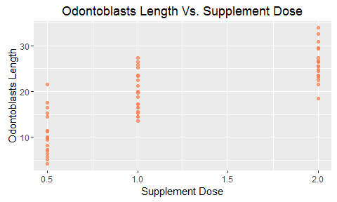
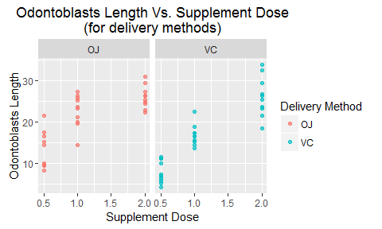
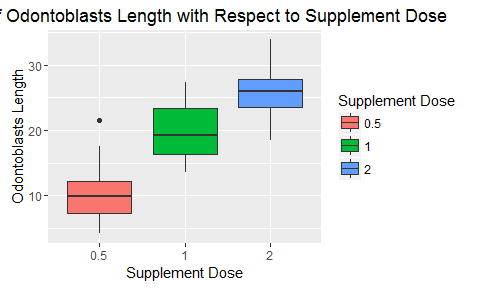

# Statistical Inference: Basic  Inferential Data Analysis
Uriel Tallon  
Saturday, August 06, 2016  

## 1. Context

The following report is part of a required peer-reviewed assessment from the _Statistical Inference_ course, one of the ten courses from the __Coursera Data Science Specialty__ from Johns Hopkins University.

The purpose of this report is perform some basic inferential data analysis on an actual dataset, namely the `ToothGrowth` dataset which is provided with R. The different parts of the analysis are:

* Some exploratory data analysis.

* Basic summary of the data.

* Hypothesis testing.

* Conclusion.

Plotting will be done with the library `ggplot2`.

## 2. Load and Explore:

The dataset we are goin to analyze is the `ToothGrowth` dataset.

  len  supp    dose
-----  -----  -----
  4.2  VC       0.5
 11.5  VC       0.5
  7.3  VC       0.5
  5.8  VC       0.5
  6.4  VC       0.5
 10.0  VC       0.5

The data provides some measurement of the length of the odontoblasts (cells responsible for tooth growth) in 60 different guinea pigs whose diet has been supplemented with vitamin C through 2 different methods:

* Orange juice (reported as `OJ` in the dataset)

* Ascorbic acid (reported as `VC` in the dataset)

For each supplement, various doses have been used (0.5, 1 and 2 mg/day, 10 observations for each dose).

First, let's plot the length vs. the dose, without considering the delivery method:

<!-- -->

Then try to distinguish between the different delivery methods:

<!-- -->

The dispersion of the length for the `VC` delivery method seems higher, but it's hard to say if it is significant. Let's look at an equivalent boxplot:

<!-- -->

So the median of the `OJ` delivery method is slightly higher than the `VC` method. However, the `VC` method values are much more spread. What about if we consider only the dose:

<!-- -->

According to this last plot, it looks like the variance in the length is more correlated with the dose of the supplement than with its delivery method, especially if the delivered dose is equal to or higher than 1mg/day.

## 3. Data Summary:

A brief data summary of some of the data statistics, including the mean $\mu$ and variance $\sigma^2$.

| ITEM        | Orange Juice  | Ascorbic Acide  | $dose < 1.0$  | $dose \geq 1.0$ |
|-------------|---------------|-----------------|---------------|-----------------|
| $\mu$       | 20.663     | 16.963       | 10.605    | 22.918      |
| $\sigma^2$  | 43.633     | 68.327       | 20.248    | 26.826      |

As we can see, the variances for the delivery method are not equal; however, they are closer to each other when considering only low dose and high dose.

## 4. Test for Delivery Method

We will now perform a T test to check if there is a significant difference between the 2 delivery methods. The sample sizes are equal (30 for both methods). The variance however is different. The t statistic can be computed as:

$$
\frac{\bar{X}_1 - \bar{X}_2}{\sqrt{\frac{\sigma^2_1 + \sigma^2_2}{n}}}
$$

With $\bar{X}_1$ (respectively $\bar{X}_2$) being the mean of the length when the delivery method is through orange juice (respectively ascorbic acid).

And the degree of freedom can be computed as:

$$
\frac{\left(\frac{\sigma^2_1}{n_1} + \frac{\sigma^2_2}{n_2}\right)^2}
{\left(\frac{\sigma^2_1}{n_1}\right)^2 / (n_1 - 1) + \left(\frac{\sigma^2_1}{n_2}\right)^2 / (n_2 - 1)}
$$

With $\sigma_1$ (respectively $\sigma_2$) being the standard deviation of the length when the delivery method is through orange juice (respectively ascorbic acid).

The following table gives a summary of the results:

| ITEM                    | results                         |
|-------------------------|---------------------------------|
| T stat.                 | 1.9152683             |
| p-value                 | 0.0606345               |
| Confidence int. (lower) | -0.1710156           |
| Confidence int. (upper) | 7.5710156           |

As we can see, the p-value is higher than $\alpha = 0.05$. Consequently, there is no significant difference between the 2 delivery methods.

## 5. Test For Dose

Now that we've seen the difference in delivery method is not statistically significant, let's see if the dose is. For the purpose of this test, we have divided the dataset between low doses (lower than 1.0mg/day) and high dose (higher than or equal to 1.0mg/day).

The following table provides the results of the test:

| ITEM                    | results                         |
|-------------------------|---------------------------------|
| T stat.                 | -9.4907367             |
| p-value                 | 3.8725623\times 10^{-12}               |
| Confidence int. (lower) | -14.9283333           |
| Confidence int. (upper) | -9.6966667           |

The p-value here is extremely small so we can assume the difference in delivery is statistically significant.

Moreover, with 95% confidence we can state that the mean of the odontoblasts' length with a dose lower than 1.0mg/day is somewhat 10 to 15 less than the mean of the length with a delivery dose higher than or equal to 1.0mg/day.

## 6. Conclusion

Using some basic statistical inference techniques, we were able to determine the significance of 2 different variables for a particular dataset. Here, we were able to determine that there is no statistically significant differences between the delivery method of vitamin C (orange juice or ascorbic acide). However there is a statistically significant difference when it comes to the delivery dose, particularly if it is higher than or equal to 1.0mg/day.
