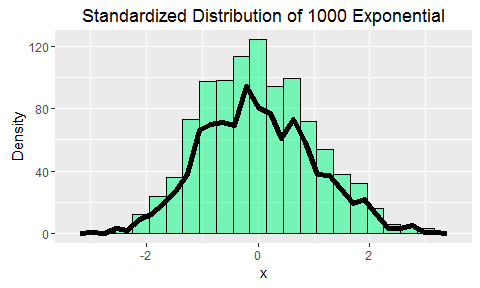

# Statistical Inference: The Central Limit Theorem Applied to the Exponential Distribution
Uriel Tallon  
Saturday, August 06, 2016  

## 1. Context

The following report is part of a required peer-reviewed assessment from the _Statistical Inference_ course, one of the ten courses from the __Coursera Data Science Specialty__ from Johns Hopkins University.

The purpose of this report is to illustrate the _Central Limit Theorem_ (or CLT) through simulations by looking at the behavior of the exponential distribution.

To illustrate, we will use the library `ggplot2`.

## 2. The Exponential Distribution

The exponential distribution is the probability distribution that describes the time between events in a _Poisson Process_ (source: [Wikipedia](https://en.wikipedia.org/wiki/Exponential_distribution)). It is characterized by a rate parameter $\lambda$, where $\frac{1}{\lambda} = \mu = \sigma$. In plain words, the inverse of the rate is both equal to the mean and the standard deviation. The following plot shows the probability density function for several values of lambda:

<!-- -->

## 3. Simulation

In this part, we will perform a simulation that will help us understand the Central Limit Theorem. The main statement of this theorem is that the distribution of averages of independent and identically distributed random variables becomes that of a standard normal as the sample size increases.

For this experiment, we will set $\lambda = 0.2$ and perform a thousand simulations, each time averaging 40 exponentials.

<!-- -->

We know that by doing this, according to the Central Limit Theorem, we have approximated a normal distribution such as $N(\mu, \sigma^2 / n)$, with $\mu = \sigma = \frac{1}{\lambda} = 5$ (for $\lambda = 0.2$). We can have an insight on this by plotting the equivalent normal distribution:

<!-- -->

## 4. Comparison Theory Vs. Actual

We know the theoretical mean of our simulated distribution is $\frac{1}{\lambda}$ with $\lambda = 0.2$, the mean is equal to 5. We can calculate the actual mean of the distribution, which gives 4.9866. As expected, the value is almost equal to 5, so far the CLT hods true.

On the other hand, the theoretical variance of the distribution is $\sigma^2 / n$ with $n = 40$ and $\sigma = 5$. That gives us:

* A theoretical variance of 0.625.

* An actual variance of 0.6317

As we can see, they are both very close to each other.

One last thing we can do to persuade ourself that the Central Limit Theorem holds true in this pparticular case is to compare the quantiles of the distribution to those of the equivalent normal distribution:

<!-- -->

Most of the points fall aligned with the line $f(x) = x$ (although, the distribution appears slightly positively skewed, which means there is a long tail towards largest values), meaning our distribution can be assimilated to a normal one.

For the record, we know it is possible to standardize the distribution by substracting the mean of the means to the means (sic) and divide them by their standard deviation:

<!-- -->

The distribution appears then centered on 0 and with a standard deviation of 1.

## 5. Conclusion

By simulation, we were able to have a glimpse of the usefulness of the Central Limit Theorem: provided the sample size is high enough and regardless of the original distribution, the distribution of averages of _iid_ can be approximated as a normal one. We have seen the theoretical values actually match the real ones quite fairly. This is also true for a distribution that has little likeness to the normal one, such as the exponential distribution.
