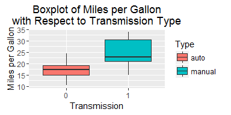
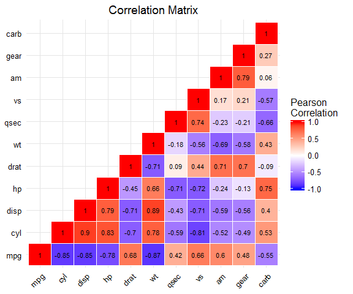
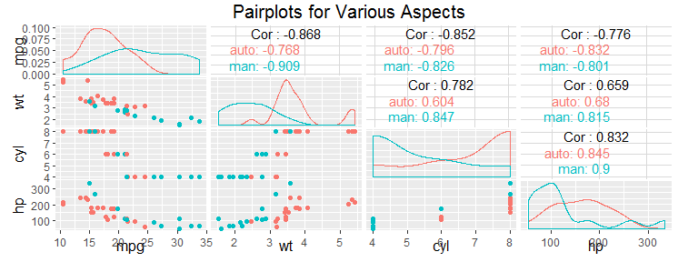
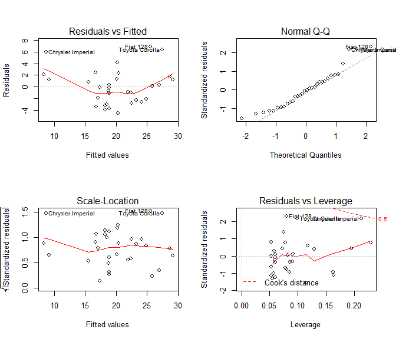
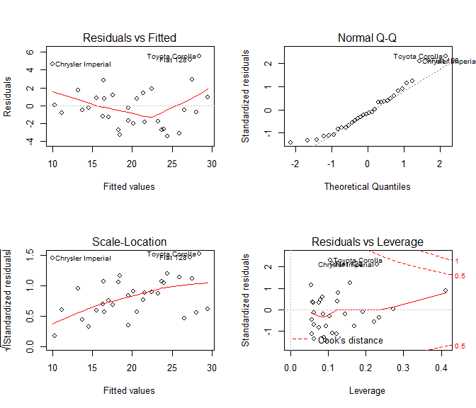

# Regression Models: Case Study
Uriel Tallon  
Friday, August 19, 2016  

## 1. Context

The following report is part of a required peer-reviewed assessment from the _Regression Models_ course, one of the ten courses from the __Coursera Data Science Specialty__ offered by Johns Hopkins University.

The purpose of this report is to perform basic data analysis using regression models and determine how different regressors might influence the outcome. We will work with the dataset `mtcars` which comprises 10 aspects of 32 differents automobile models, along with their fuel consumption. The different observed variables are:

| Var.        | Description                                                       |
|-------------|-------------------------------------------------------------------|
| __mpg__     | Miles per gallon                                                  |
| __cyl__     | Number of cylinders                                               |
| __disp__    | Displacement (in cu.in.)                                          |
| __hp__      | Gross horsepower                                                  |
| __drat__    | Rear axle ratio                                                   |
| __wt__      | Weight in 1000 lbs                                                |
| __qsec__    | 1/4 mile time                                                     |
| __vs__      | V engine (0) or straight engine (1)                               |
| __am__      | Automatic (0) or manual transmission (1)                          |
| __gear__    | Number of forward gears                                           |
| __carb__    | Number of carburetors                                             |

We will focus on the 2 following problems:

* Is an automatic or manual transmission better for MPG?

* Quantify the MPG difference between automatic and manual transmission.

An appendix features additional plots for better understanding of the data.

## 2. Statistical Inference

If we suppose the null hypothesis is there is no difference between the automatic and the manual transmission, we can perform a Student's T test is performed on 2 subset of the dataset, one with the automatic transmission and the other with the manual transmission. The resuslted p-value is 0.0014, which is lower than 0.05. There is a significant difference between manual and automatic transmission.

## 3. Basic Data Exploration and First Model

The provided data looks like this:

                   mpg   cyl   disp    hp   drat      wt    qsec   vs   am   gear   carb
---------------  -----  ----  -----  ----  -----  ------  ------  ---  ---  -----  -----
Mazda RX4         21.0     6    160   110   3.90   2.620   16.46    0    1      4      4
Mazda RX4 Wag     21.0     6    160   110   3.90   2.875   17.02    0    1      4      4
Datsun 710        22.8     4    108    93   3.85   2.320   18.61    1    1      4      1
Hornet 4 Drive    21.4     6    258   110   3.08   3.215   19.44    1    0      3      1

A look on the boxplot in the appendix 1. shows that the median of miles per gallon for automatic transmission is lower than the one for manual transmission. A simple linear model where `mpg` is selected as the outcome and `am` as the regressor seems to comfirm this:

                Estimate   Std. Error     t value   Pr(>|t|)
------------  ----------  -----------  ----------  ---------
(Intercept)    17.147368     1.124602   15.247492   0.000000
am              7.244939     1.764422    4.106127   0.000285

In the model, the automatic transmission is used as the reference. It appears then that the use of a manual transmission would increase the mean miles per gallon by 7.245. The 95% confidence interval for this variation is:

* Lower bound (2.5%): 3.6415096

* Lower bound (97.5%): 10.848369

So at first sight, it appears an automatic transmission is not as efficient as a manual one in terms of mileage. However, by voluntarily putting aside the other variables, maybe we are occulting other potential influences on said mileage. In order to check this, let's dive deeper into the analysis.

## 4. Possible Relevant Variables and Extended Model

The appendix 2. shows a correlation matrix between the different variables. It appears that the correlation between `am` and `mpg` is slightly significant. There is also a strong negative correlation between `mpg` and `wt`. There is also a cluster of 3 variables, namely `cyl`, `disp` and `hp`, who share a significant negative correlation with `mpg`. On the other hand, `cyl` and `disp` are positively correlated with `hp`.

The appendix 3. shows pairplots with some selected variables, namely `mpg`, `wt`, `cyl` and `hp`. 2 different colors are used to distinguish  automatic transmission from manuals. For the weight, we cn see for instance, that the cars with the highest mileage are both the lighter ones with a manual transmission. Same thing for the horsepower: high horsepower with manual transmission apparently yields better mileage while, on the other hand, lower horsepower models with automatic transmission have slightly lower mileage.

Let's create 2 other models:

* One with `mpg` defined as the outcome and both `am` and `wt` as the regressors.

* Another one with `mpg` defined as the outcome and `am`, `wt` and `hp` as the regressors.

### a. Transmission and Weight

                 Estimate   Std. Error      t value    Pr(>|t|)
------------  -----------  -----------  -----------  ----------
(Intercept)    37.3215513    3.0546385   12.2179928   0.0000000
am             -0.0236152    1.5456453   -0.0152786   0.9879146
wt             -5.3528114    0.7882438   -6.7908072   0.0000002

This model brings new insights. As expected, the heavier the car, the lower the mileage. But at the same time, manual transmission seems to affect the mileage in a negative way (contrary to our original model).

The appendix 4. shows the diagnostic plots for this model. The residuals vs. fitted show a kind of bowl-shaped pattern (maybe accounting for the possibility of a non-linear relationship between the coefficients). Three car models appear to be apart from the others:

* Chrysler Imperial

* Toyota Corolla

* Fiat 128

The scale-location plot is roughly flat, showing no apparent heterosceedacity. 

### b. Transmission, Weight and Horsepower

                 Estimate   Std. Error     t value    Pr(>|t|)
------------  -----------  -----------  ----------  ----------
(Intercept)    34.0028751    2.6426593   12.866916   0.0000000
am              2.0837101    1.3764202    1.513862   0.1412682
wt             -2.8785754    0.9049705   -3.180850   0.0035740
hp             -0.0374787    0.0096054   -3.901830   0.0005464

With this model, we are back to the conclusions drawn with our first model where the automatic transmission was worse than the manual one for the mileage. At the same time, both horsepower and weight influence the mileage in a negative way.

The scale-location diagnostic plot in the appendix 5. shows a slight possibility of heteroscedacity.

### c. Significance of Added Regressors

We perform the `anova` test for our nested models:

 Res.Df        RSS   Df   Sum of Sq          F      Pr(>F)
-------  ---------  ---  ----------  ---------  ----------
     30   720.8966   NA          NA         NA          NA
     29   278.3197    1   442.57690   68.73415   0.0000000
     28   180.2911    1    98.02863   15.22428   0.0005464

In conclusion, adding the weight appears to be very significant as the p-value is extremely low. Adding the horsepower as an additional regressor shows a lower p-value but still significant, even if we consider a very low alpha. However, this is true only under the assumptions that the residuals are normally distributed. A Shapiro-Wilk test yields a p-value of 0.106, which is high enough for us to fail to reject normality.

## 5. Conclusion

As a conclusion, we can say that manual transmissions appear to be more fuel-efficient. Considering some major aspects of cars, such as weight and gross horsepower, a manual transmission allow for around 2 more miles per gallon.

## Appendix

### 1. Boxplots

### 2. Correlation

### 3. Pairplot

Selected variables: __mpg__, __wt__, __am__, __cyl__, __hp__.

### 4. Diagnostics for `am` + `wt`

### 5. Diagnostics for `am` + `wt` + `hp`

