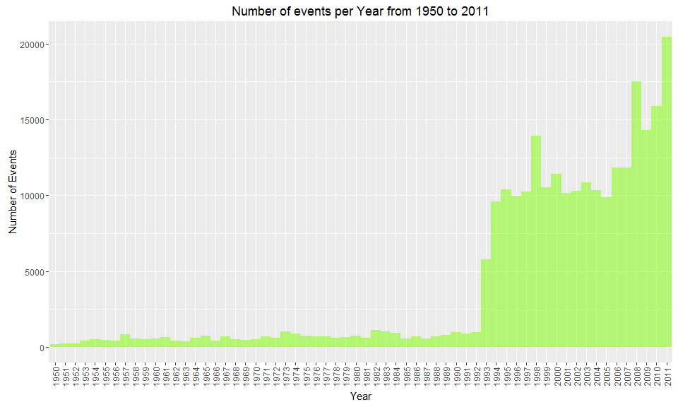
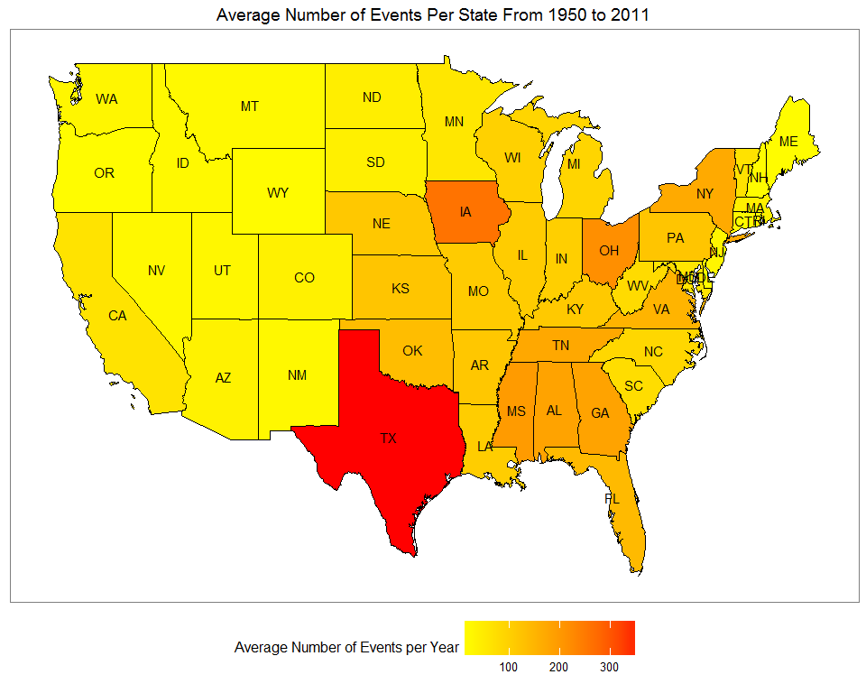
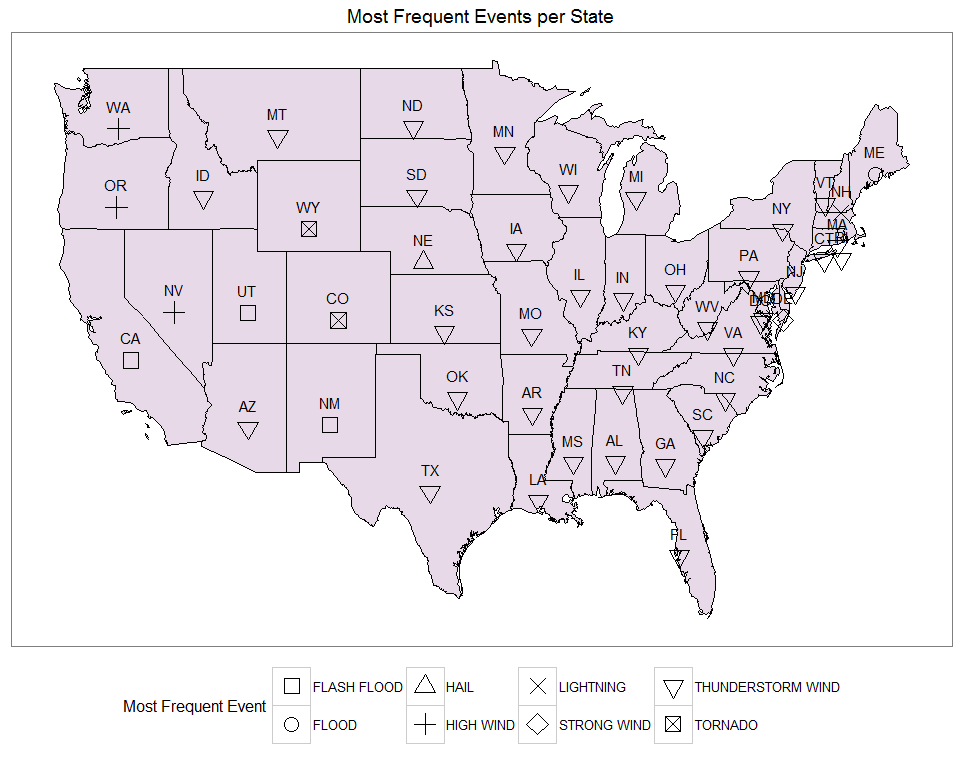
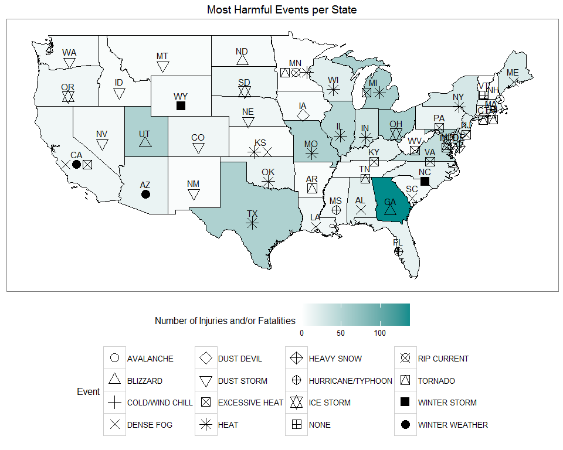
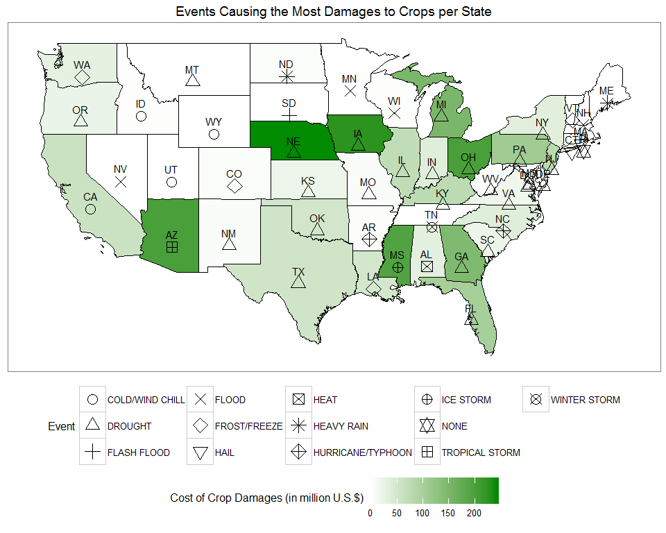
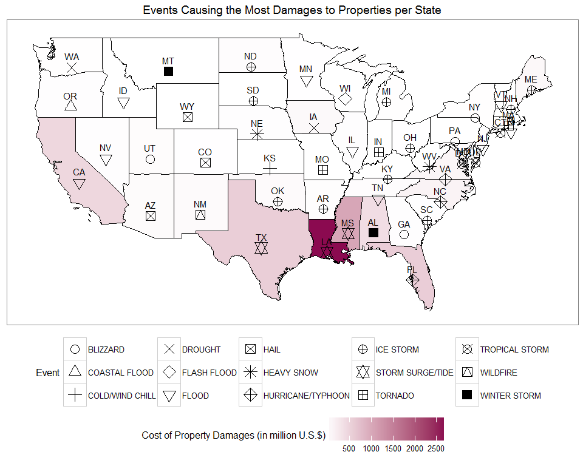

# Weather Events - Cost and Fatalities
Uriel Tallon  
Monday, July 25, 2016  

## I - Context

This report was originally a mandatory peer assessment for the Coursera course _Reproducible Research_ which is part of the __Data Science Specialization__. After a while, I came back to this project and enriched it with a new spatial analysis and revamped tables and graphs. While more complete than before, the report is not suitable anymore for a Coursera submission due to the large number of graphs (original instructions limited the number of drawing figures to 3).

The assessment consists in analyzing a set of data and exploiting them to answer a few questions. The provided data set comes from the U.S. National Oceanic and Atmospheric Administration's (NOAA) storm database. It includes several information regarding extreme weather conditions and their effects on both the population and the infrastructures. The data set covers a time period from year 1950 and ends in November 2011

The analysis has to provide clear answers to the following questions:

* Across the United States, which types of events are most harmful with respect to population's health?

* Across the United States, which types of events have the greatest economic consequences?

However, we will limit the analysis to mainland U.S.A (excluding the states of Alaska, Hawaii and Puerto Rico) in order to draw simpler maps. Several packages are necessary to reproduce the analysis, please consult the appendix for a snapshot of the RStudio environment.

## II - Data Loading and Explanations

The data are provided as a single `.csv` file compressed with the __bz2__ algorithm. Using R, the file can be directly read and the content stored in a `raw` variable. The following computation will be cached, as the data are quite large.


```r
raw <- read.csv("../data/repdata_data_StormData.csv.bz2", stringsAsFactors = FALSE)
```

The data set has the following variables:


```r
colnames(raw)
```

```
##  [1] "STATE__"    "BGN_DATE"   "BGN_TIME"   "TIME_ZONE"  "COUNTY"    
##  [6] "COUNTYNAME" "STATE"      "EVTYPE"     "BGN_RANGE"  "BGN_AZI"   
## [11] "BGN_LOCATI" "END_DATE"   "END_TIME"   "COUNTY_END" "COUNTYENDN"
## [16] "END_RANGE"  "END_AZI"    "END_LOCATI" "LENGTH"     "WIDTH"     
## [21] "F"          "MAG"        "FATALITIES" "INJURIES"   "PROPDMG"   
## [26] "PROPDMGEXP" "CROPDMG"    "CROPDMGEXP" "WFO"        "STATEOFFIC"
## [31] "ZONENAMES"  "LATITUDE"   "LONGITUDE"  "LATITUDE_E" "LONGITUDE_"
## [36] "REMARKS"    "REFNUM"
```

The variables provide several information regarding the time of occurence for a particular event and both its financial and human consequencies (in terms of injuries and/or fatalities). Among the variables, the following are worth mentioning:

* __STATE____ and __STATE__ provide respectively the state code and the abbreviated name of the state where the event occurred.

* __COUNTY__ and __COUNTYNAME__ provide respectively the county code and the full county name where the event occurred.

* __EVTYPE__ is the actual name of the event (typhoon, rainstorm, etc...); the documentation provides 48 different designation for weather events.

* __BGN_DATE__, __BGN_TIME__, __TIME_ZONE__, __END_DATE__ and __END_TIME__ provide time information for a particular event, specifically when it began and when it ended.

* __FATALITIES__ and __INJURIES__ provide quantitative information regarding the number of victims for a particular event and whether this ended as a casualty (for "FATALITIES") or an injury.

* __PROPDMG__ and __CROPDMG__ provide the actual cost of the event, in terms of USD, with respect to property damage or crop damage.

* __PROPDMGEXP__ and __CROPDMGEXP__ provides a multiplicator for the actual cost given in the above 2 variables.

* __WFO__ provides the abbreviated name of the Weather Forecast Office who reported the event.

* __REMARKS__ provides some useful insights regarding a particular event and its consequencies.

The following documents can give a few insights on how the data are collected and reported inside the database:

* National Weather Service [Storm Data Documentation](https://d396qusza40orc.cloudfront.net/repdata/peer2_doc/pd01016005curr.pdf)

* National Climatic Data Center Storm Events [FAQ](https://d396qusza40orc.cloudfront.net/repdata/peer2_doc/NCDC Storm Events-FAQ Page.pdf)

## III - Data Processing

### 1. Variables' Selection

To perform the analysis, the `raw` dataset has to be re-arranged in some way. As a matter of fact, several observations are not standardized and values are missing for some variables.

After some reflections, we will first arrange a preparatory data set `prep` which contains the following variables:

* __EVTYPE__: the type of event.

* __BGN_DATE__: the date of the beginning of the event; will be reworked to keep only the year.

* __STATE__: will be useful for the spatial analysis.

* __FATALITIES__ and __INJURIES__: necessary to address the question about which event is the most harmful one.

* __PRODMG__, __PROPDMGEXP__, __CROPDMG__ and __CROPDMGEXP__: necessary to address the question about which event has the greatest economic consequencies.

* __REMARKS__: we keep this one as it is useful to accurately determine which kind of event we are dealing with.

To perform the complete study, we will use several packages, namely:

* `dplyr` for raw data manipulation.

* `rgdal` and `rgeos` for spatial data manipulation.

* `ggplot2` for plotting.

* `grid` and `gridExtra` for multi-panel plots.

* `knitr` for better quality tables.

The below code-chunks will automatically attempt to load the required packages; if the packages are not available on the system, they will be downloaded from the CRAN repository and loaded:


```r
for (pck in c("dplyr", "rgdal", "rgeos", "knitr", "ggplot2", "grid", "gridExtra")) {
  if (!require(pck, character.only = TRUE)) {
    install.packages(pck)
    library(pck, character.only = TRUE)
  }
}
```

Then we prepare the new dataset:


```r
prep <- tbl_df(raw) %>% select(BGN_DATE, EVTYPE, STATE, FATALITIES, INJURIES, PROPDMG, PROPDMGEXP, CROPDMG, CROPDMGEXP, REMARKS)
```

In order to keep only the years in the __BGN_DATE__ variable, a few additional manipulations are necessary:


```r
prep$BGN_DATE <- sapply(prep$BGN_DATE, function(x) {
  unlist(strsplit(x, " "))[1]
})
prep$BGN_DATE <- as.Date(prep$BGN_DATE, format = "%m/%d/%Y")
prep$BGN_DATE <- format(prep$BGN_DATE, "%Y")
kable(prep[1:5, ])
```


BGN_DATE   EVTYPE    STATE    FATALITIES   INJURIES   PROPDMG  PROPDMGEXP    CROPDMG  CROPDMGEXP   REMARKS 
---------  --------  ------  -----------  ---------  --------  -----------  --------  -----------  --------
1950       TORNADO   AL                0         15      25.0  K                   0                       
1950       TORNADO   AL                0          0       2.5  K                   0                       
1951       TORNADO   AL                0          2      25.0  K                   0                       
1951       TORNADO   AL                0          2       2.5  K                   0                       
1951       TORNADO   AL                0          2       2.5  K                   0                       

### 2. Working on the Costs

We will try to tackle the issue of the costs first, and particularly, how the variables `PRPDMGEXP` and `CROPDMGEXP` affect the values given as the actual costs in `PROPDMG` and `CROPDMG`. A table give us some hints:


```r
table(prep$PROPDMGEXP)
```

```
## 
##             -      ?      +      0      1      2      3      4      5 
## 465934      1      8      5    216     25     13      4      4     28 
##      6      7      8      B      h      H      K      m      M 
##      4      5      1     40      1      6 424665      7  11330
```

The result yields several values, some numerical, some not. A look at the documentation gives an idea (for instance `K` equals `1e`). We can assume the numerical values are given as a power of 10, `M` should be `10^6`, `K` should be `10^3` and `B` should be `10^9`. We will assume the value `0` for the blanks, `-`, `+` and `?`. It is doubtful some damages in milli would be reported or worth mentionning, therefore we will assume `M` and `m` are the same (namely 10^3).

However, `H` and `h` both pose a particular issue as they are not related to anything (no `H` symbol in the SI system). This concerns 7 values in total. We will treat them as outliers and remove them from the data set.


```r
prep <- prep[which(prep$PROPDMGEXP != 'h' & prep$PROPDMGEXP != 'H'), ]
mod.prop <- prep %>% select(PROPDMG, PROPDMGEXP)
mod.prop$PROPPOW <- sapply(mod.prop$PROPDMGEXP, function(x){
  val <- as.character(x)
  if (val == '' | val == '+' | val == '-' | val == '?') {
    as.numeric(0)
  }
  else if (val == 'K') {
    as.numeric(3)
  }
  else if (val == 'm' | val == 'M') {
    as.numeric(6)
  }
  else if (val == 'B') {
    as.numeric(9)
  }
  else {
    as.numeric(val)
  }
})
mod.prop <- mod.prop %>% mutate(PROPDMGTOT = PROPDMG * (10^PROPPOW))
head(mod.prop)
```

```
## # A tibble: 6 x 4
##   PROPDMG PROPDMGEXP PROPPOW PROPDMGTOT
##     <dbl>      <chr>   <dbl>      <dbl>
## 1    25.0          K       3      25000
## 2     2.5          K       3       2500
## 3    25.0          K       3      25000
## 4     2.5          K       3       2500
## 5     2.5          K       3       2500
## 6     2.5          K       3       2500
```

We can perform the same analysis for the crop damages, first by looking at the factors:


```r
table(prep$CROPDMGEXP)
```

```
## 
##             ?      0      2      B      k      K      m      M 
## 618406      7     19      1      9     21 281832      1   1994
```

We will apply roughly the same strategy as for the property damages, but we will also assume `k` and `K` are essentially the same. No rows will be removed.


```r
mod.crop <- prep %>% select(CROPDMG, CROPDMGEXP)
mod.crop$CROPPOW <- sapply(mod.crop$CROPDMGEXP, function(x){
  val <- as.character(x)
  if (val == '' | val == '?') {
    as.numeric(0)
  }
  else if (val == 'K' | val == 'k') {
    as.numeric(3)
  }
  else if (val == 'm' | val == 'M') {
    as.numeric(6)
  }
  else if (val == 'B') {
    as.numeric(9)
  }
  else {
    as.numeric(val)
  }
})
mod.crop <- mod.crop %>% mutate(CROPDMGTOT = CROPDMG * (10^CROPPOW))
head(mod.crop)
```

```
## # A tibble: 6 x 4
##   CROPDMG CROPDMGEXP CROPPOW CROPDMGTOT
##     <dbl>      <chr>   <dbl>      <dbl>
## 1       0                  0          0
## 2       0                  0          0
## 3       0                  0          0
## 4       0                  0          0
## 5       0                  0          0
## 6       0                  0          0
```

We can now add the new data on prices to a transition data set, that we will use soon to work on the event types:


```r
mod.fin <- bind_cols(mod.prop, mod.crop) %>% select(PROPDMGTOT, CROPDMGTOT)
mod.fin <- bind_cols(prep, mod.fin) %>% select(BGN_DATE, EVTYPE, STATE, FATALITIES, INJURIES, PROPDMGTOT, CROPDMGTOT, REMARKS)
```

### 3. Working on Events' Classification

Now comes the hardest part. As mentioned in part II, the documentation provided with the data set mentions 48 different and clearly defined weather events. Let's create a vector holding those types: 


```r
events.type <- c("ASTRONOMICAL LOW TIDE", "AVALANCHE", "BLIZZARD",
                 "COASTAL FLOOD", "COLD/WIND CHILL", "DEBRIS FLOW",
                 "DENSE FOG", "DENSE SMOKE", "DROUGHT", "DUST DEVIL",
                 "DUST STORM", "EXCESSIVE HEAT", "EXTREME COLD/WIND CHILL",
                 "FLASH FLOOD", "FLOOD", "FROST/FREEZE", "FUNNEL CLOUD",
                 "FREEZING FOG", "HAIL", "HEAT", "HEAVY RAIN", "HEAVY SNOW",
                 "HIGH SURF", "HIGH WIND", "HURRICANE/TYPHOON", "ICE STORM",
                 "LAKE-EFFECT SNOW", "LAKESHORE FLOOD", "LIGHTNING",
                 "MARINE HAIL", "MARINE HIGH WIND", "MARINE STRONG WIND",
                 "MARINE THUNDERSTORM WIND", "RIP CURRENT", "SEICHE",
                 "SLEET", "STORM SURGE/TIDE", "STRONG WIND",
                 "THUNDERSTORM WIND", "TORNADO", "TROPICAL DEPRESSION",
                 "TROPICAL STORM", "TSUNAMI", "VOLCANIC ASH", "WATERSPOUT",
                 "WILDFIRE", "WINTER STORM", "WINTER WEATHER")
```

However, a rapid look at the data set and we can conclude the events' designation is not as standardized as it should be:


```r
length(unique(mod.fin$EVTYPE))
```

```
## [1] 985
```

This yields 985 distinct event types, way more than the 48 standard types. We have to find a way to sort all those events and somehow link them to the 48 standard types.

First things first, let's recall we are only interesting in events that have actual economical or health impacts. We will then select only the data with non null values in fatalitites, injuries and crop/property damage:


```r
mod.fin <- mod.fin %>% filter(FATALITIES > 0 |
                              INJURIES > 0 |
                              PROPDMGTOT > 0 |
                              CROPDMGTOT > 0)
```

In order to facilitate the processing of the data, we will cast all the event types to upper case and remove whitespaces from the beginning and the end. A first easy step is also to convert every occurence of __TSTM__ to __THUNDERSTORM__.


```r
mod.fin$EVTYPE <- toupper(as.character(mod.fin$EVTYPE))
mod.fin$EVTYPE <- trimws(mod.fin$EVTYPE)
mod.fin$EVTYPE <- gsub("TSTM", "THUNDERSTORM", mod.fin$EVTYPE)
```

Regarding the different types of events, we can make the following remarks:

* There are typos (e.g. __AVALANCE__ instead of __AVALANCHE__) and unwelcome plurals (e.g. __THUNDERSTORM WINDS__ instead of __THUNDERSTORM WIND__) or continuous tense (__COASTAL FLOODING__ istead of __COASTAL FLOOD__).

* A lot of event types are actually the standard types but with unwanted precisions (e.g. the name of the hurricane is added to the __HURRICANE__ entry).

* At least one event is unknown.

* Some events do not rely on the 48 standard events or are even comically strange (e.g. __EXCESSIVE WETNESS__).

The conclusion is it will be a real pain to automatize the cleaning and to be honest, near impossible unless  but it may be even more painful to try to do it by hand.

The following code is a first approach: it will simply match the content of the __EVTYPE__ column with the relevant standard event if a direct similarity is found.


```r
mod.fin$CLEAN <- sapply(mod.fin$EVTYPE, function(x){
  for (i in seq_along(events.type)) {
    splitvec <- unlist(strsplit(events.type[i], "/"))
    res <- sapply(splitvec, function(patt){
      grep(patt, x, fixed = TRUE)
    })
    if (length(unlist(res)) != 0) {
      return(events.type[i])
    }
  }
  return(x)
})
```

Most of the remaining entries will have to be cleaned by hand; when the term used in the raw data is ambiguous, the remarks can provide useful insights and the provided _National Weather Service Instruction_ also gives directives on how to label some events. 

However, sometimes having to decide between several different simultaneously occurring factors, the labelling comes out as arbitrary:


```r
mod.fin$CLEAN <- gsub("APACHE COUNTY|SEVERE THUNDERSTORM[S]?|^THUNDERSTORM[SW]?$|THUNDERSTORMWINDS", "THUNDERSTORM WIND", mod.fin$CLEAN)
mod.fin$CLEAN <- gsub("AVALANCE", "AVALANCHE", mod.fin$CLEAN)
mod.fin$CLEAN <- gsub("BLOWING DUST", "DUST STORM", mod.fin$CLEAN)
mod.fin$CLEAN <- gsub("BLOWING SNOW|SNOW/BLOWING SNOW|LATE SEASON SNOW|RECORD SNOW", "BLIZZARD", mod.fin$CLEAN)
mod.fin$CLEAN <- gsub("COASTAL EROSION|COASTAL SURGE", "COASTAL FLOOD", mod.fin$CLEAN)
mod.fin$CLEAN <- gsub("DAM BREAK|DROWNING|DOWNBURST|EXCESSIVE RAINFALL|EXCESSIVE WETNESS|TORRENTIAL RAINFALL|UNSEASONAL RAIN", "HEAVY RAIN", mod.fin$CLEAN)
mod.fin$CLEAN <- gsub("DENSE SMOKE", "DENSE FOG", mod.fin$CLEAN)
mod.fin$CLEAN <- gsub("EXTREME WINDCHILL", "EXTREME COLD/WIND CHILL", mod.fin$CLEAN)
mod.fin$CLEAN <- gsub("^FALLING SNOW/ICE|^SNOW$|^SNOW ACCUMULATION|^SNOW AND ICE|^SNOW SQUALL[S]?|^SNOW/ ICE|^EXCESSIVE SNOW|^COASTALSTORM", "HEAVY SNOW", mod.fin$CLEAN)
mod.fin$CLEAN <- gsub("^FOG", "DENSE FOG", mod.fin$CLEAN)
mod.fin$CLEAN <- gsub("FREEZING DRIZZLE|^FREEZING RAIN.*|FREEZING SPRAY|LIGHT FREEZING RAIN|GLAZE.*|^SNOW/ICE|SNOW[/ ]FREEZING RAIN|BLACK ICE", "FROST/FREEZE", mod.fin$CLEAN)
mod.fin$CLEAN <- gsub("GRADIENT WIND|GUSTY WIND.*|STORM FORCE WINDS|WET MICROBURST", "STRONG WIND", mod.fin$CLEAN)
mod.fin$CLEAN <- gsub("HEAVY LAKE SNOW|LAKE EFFECT SNOW", "LAKE-EFFECT SNOW", mod.fin$CLEAN)
mod.fin$CLEAN <- gsub("HEAVY MIX", "HEAVY SNOW", mod.fin$CLEAN)
mod.fin$CLEAN <- gsub("HEAVY PRECIPITATION|THUNDERSNOW|COASTAL STORM", "WINTER STORM", mod.fin$CLEAN)
mod.fin$CLEAN <- gsub("HEAVY SHOWER|^HVY RAIN", "HEAVY RAIN", mod.fin$CLEAN)
mod.fin$CLEAN <- gsub("HEAVY SURF.*|HEAVY SWELLS|HIGH SEAS|HIGH SWELLS|HIGH WAVES|ROGUE WAVE|HEAVY SEAS|WIND AND WAVE|HAZARDOUS SURF", "HIGH SURF", mod.fin$CLEAN)
mod.fin$CLEAN <- gsub("^HIGH$|HIGH  WINDS|NON-SEVERE WIND DAMAGE|BEACH EROSION|DRY MI[R]?C[R]?OBURST.*", "HIGH WIND", mod.fin$CLEAN)
mod.fin$CLEAN <- gsub("HIGH WATER", "FLASH FLOOD", mod.fin$CLEAN)
mod.fin$CLEAN <- gsub("HYPOTHERMIA.*|HYPERTHERMIA.*|LOW TEMPERATURE|COOL AND WET", "COLD/WIND CHILL", mod.fin$CLEAN)
mod.fin$CLEAN <- gsub("^ICE$|^IC[EY] [AOJFR].*|LIGHT SNOW.*", "WINTER WEATHER", mod.fin$CLEAN)
mod.fin$CLEAN <- gsub("WHIRLWIND", "DUST DEVIL", mod.fin$CLEAN)
mod.fin$CLEAN <- gsub("LIG[HN]T[N]{0,1}ING", "LIGHTNING", mod.fin$CLEAN)
mod.fin$CLEAN <- gsub("MARINE ACCIDENT|MARINE MISHAP|ROUGH SEAS|ROUGH SURF", "MARINE STRONG WIND", mod.fin$CLEAN)
mod.fin$CLEAN <- gsub("MICROBURST.*|^WIND[S]?$|WIND DAMAGE|WIND STORM", "STRONG WIND", mod.fin$CLEAN)
mod.fin$CLEAN <- gsub("MIXED PRECIP.*|WINTRY MIX", "WINTER WEATHER", mod.fin$CLEAN)
mod.fin$CLEAN <- gsub("^MUD.*|ROCK SLIDE|LANDSLUMP|LANDSLIDE[S]?", "DEBRIS FLOW", mod.fin$CLEAN)
mod.fin$CLEAN <- gsub("^RAIN$|RAINSTORM|RECORD RAINFALL|RAPIDLY RISING WATER|^URBAN.*", "HEAVY RAIN", mod.fin$CLEAN)
mod.fin$CLEAN <- gsub("^RAIN/SNOW", "WINTER STORM", mod.fin$CLEAN)
mod.fin$CLEAN <- gsub("^RAIN/WIND|^SEVER.*", "STRONG WIND", mod.fin$CLEAN)
mod.fin$CLEAN <- gsub("TORNDAO|LANDSPOUT", "TORNADO", mod.fin$CLEAN)
mod.fin$CLEAN <- gsub("^T[H]?U[N]?[D]?[E]+R[E]?[S]?T[R]?O[R]?M[S]?[ ]+WIN[D]?[S]?|THUNDERSTORM DAMAGE TO|GUSTNADO", "THUNDERSTORM WIND", mod.fin$CLEAN)
mod.fin$CLEAN <- gsub("WILD.*FIRE[S]?|BRUSH FIRE|FOREST FIRES|GRASS FIRES", "WILDFIRE", mod.fin$CLEAN)
mod.fin$CLEAN <- gsub("UNSEASONABLY WARM.*|WARM WEATHER", "HEAT", mod.fin$CLEAN)
```

There are 2 events that we can discard:

* The one labelled as __?__, for which we have absolutely no precisions.

* Those labelled as __OTHER__ as they cannot be precisely tied to the 48 standard event types.


```r
mod.fin <- mod.fin[which(mod.fin$CLEAN != '?' & mod.fin$CLEAN != 'OTHER'), ]
```

Now we have a fully cleaned dataset and we can began to work on the analysis.

## IV - Results

### 1. Preparation

This chapter is dedicated to the preparation of the data for the data analysis. I would like to say this work was made possible thanks to the excellent documentation provided by _Robin Lovelace_ on his [Github repository](https://github.com/Robinlovelace/Creating-maps-in-R). With a minimal commitment, it is really easy to build upon this documentation and start devising your own maps. The included tutorial also points several resources for advanced mapping.

The first thing to do is to load a shapefile defining the different polygon shapes of the different states of North-America. We will use a basic shapefile freely available on [ArcGIS](https://www.arcgis.com/home/item.html?id=f7f805eb65eb4ab787a0a3e1116ca7e5). The package will be loaded using the `readOGR` function from the `rgdal` package. The shapefile includes both Alaska and Hawaii, so we will remove them:


```r
spf <- readOGR(dsn = "../data/states_21basic", layer = "states")
```

```
## OGR data source with driver: ESRI Shapefile 
## Source: "../data/states_21basic", layer: "states"
## with 51 features
## It has 5 fields
```

```r
spf <- spf[spf@data$STATE_ABBR != "AK", ]
spf <- spf[spf@data$STATE_ABBR != "HI", ]
spf$id <- row.names(spf)
```

we will also begin arrange a transformed dataset of the spatial data, as `ggplot2` is not able to handle them directly:


```r
spf_n <- fortify(spf)
```

Now, in the cleaned dataset, match the states with those in the shapefile and rename the __STATE__ variable as __STATE_ABBR__:


```r
mod.fin <- mod.fin[mod.fin$STATE %in% as.character(spf$STATE_ABBR), ]
mod.fin <- rename(mod.fin, STATE_ABBR = STATE)
```

For the annotations of the maps, we will calculate the centroids of each state:


```r
center <- as.data.frame(gCentroid(spf, byid = TRUE))
center$STATE_ABBR <- spf$STATE_ABBR
```

### 2. Evolution of the Number of Events From 1950 to 2011

The first part of the analysis deals with the number of events per year across the whole territory of the United States of America. The events will be counted and then drawn :


```r
n_events <- mod.fin %>% group_by(BGN_DATE) %>% summarise(TOTAL_EVENTS = n())
p <- ggplot(n_events, aes(BGN_DATE, TOTAL_EVENTS)) +
  geom_bar(stat = 'identity', fill = 'lawngreen', alpha = 0.5, width = 1.0) +
  ggtitle("Number of events per Year from 1950 to 2011") +
  theme(axis.text.x = element_text(angle = 90, vjust = 0.5)) +
  labs(x = "Year", y = "Number of Events")
p
```

<!-- -->

There is something fishy in there. Originally, the number of events recorded was pretty low, then arriving at year 1993, the number of events suddenly jumps to more than 5000 and the tendency is keep increasing over the years until 2011 with more than X events recorded.

Watching this without context, it would be easy to infer that extreme weather events are increasing in occurrence. However, we are working with historical data tracing back all way to 1950. With the increase of technical means and the increasing standardization of recording process, it may be only due to more events being recorded more easily, leading to an explosion of data.

### 3. Number of Events per State

The first map we will draw will account for the number of events per state. That can give us a starting point in the spatial analysis. Each year, a state can have several events occuring, so we will compute the average number of events per year, in order to determine which state is the most subject to weather events.


```r
spd.avg <- mod.fin %>% group_by(STATE_ABBR, BGN_DATE) %>% summarise(events.total = n())
spd.avg <- ungroup(spd.avg)
spd.avg <- spd.avg %>% group_by(STATE_ABBR) %>% mutate(events.average = mean(events.total))
spd.avg <- ungroup(spd.avg) %>% select(STATE_ABBR, events.average)
spd.avg <- unique(spd.avg)
```

Then we merge the spatial data with the numerical data we've just computed:


```r
spf1 <- spf
spf1@data <- merge(spf1@data, spd.avg, by = "STATE_ABBR", all = FALSE)
spf1 <- left_join(spf_n, spf1@data)
```

And finally, here comes the plot:


```r
map <- ggplot(spf1, aes(long, lat, group = group, fill = events.average)) +
  geom_polygon() +
  geom_path(colour = "black", lwd = 0.05) +
  labs(title = "Average Number of Events Per State From 1950 to 2011") +
  theme_bw() +
  theme(axis.title = element_blank(), 
        axis.text = element_blank(), 
        axis.ticks = element_blank(), 
        axis.line = element_blank(), 
        panel.grid = element_blank()) +
  theme(legend.position = "bottom", legend.key.size = unit(1,"cm")) +
  scale_fill_gradient(name = "Average Number of Events per Year", low = "yellow", high = "red") +
  annotate("text", label = center$STATE_ABBR, x = center$x, y = center$y)
map
```

<!-- -->

for the U.S.-states-challenged (such as me), you can consult the following [Wikipedia article](https://en.wikipedia.org/wiki/List_of_U.S._state_abbreviations) which gives a comprehensive list of the U.S. abbreviations.

According to the plot, the state that suffers the most from extreme weather is the Texas, with more than 300 events on average per year. Then comes Iowa, Ohio and a cluster of states comprising of Mississipi, Alabama, Georgia and Tennessee.

### 4. Most Frequent Event Per State

An interesting thing to see is to check which event is the most frequent for a given state. That could give an idea of which state should guard itself against what.


```r
spd.fev <- mod.fin %>% group_by(STATE_ABBR, CLEAN) %>% summarise(events.total = n()) %>% mutate(events.max = max(events.total))
spd.fev <- spd.fev[spd.fev$events.total == spd.fev$events.max, ] %>% select(STATE_ABBR, CLEAN, events.max)
```

Merging the data:


```r
spf2 <- spf
spf2@data <- merge(spf2@data, spd.fev, by = "STATE_ABBR", all = FALSE)
spf2 <- left_join(spf_n, spf2@data)
```

Plotting:


```r
map <- ggplot(spf2, aes(long, lat)) +
  geom_polygon(aes(group = group), fill = "thistle", alpha = 0.6) +
  geom_path(aes(group = group), colour = "black", lwd = 0.05) +
  geom_point(data = merge(center, spd.fev, by = "STATE_ABBR"), aes(x, y - 1, shape = CLEAN), size = 5) +
  labs(title = "Most Frequent Events per State") +
  theme_bw() +
  theme(axis.title = element_blank(), 
        axis.text = element_blank(), 
        axis.ticks = element_blank(), 
        axis.line = element_blank(), 
        panel.grid = element_blank()) +
  scale_shape_manual(name = "Most Frequent Event", values = 0:7) +
  theme(legend.position = "bottom", legend.key.size = unit(1,"cm")) +
  annotate("text", label = center$STATE_ABBR, x = center$x, y = center$y)
map
```

<!-- -->

It appears thunderstorm winds are by far the most frequent events across the United States, especially in the eastern part of the territory. On the other hand, floods and flash floods are most frequent in California, Utah, New Mexico and the Maine. Tornadoes are more frequent in both Wyoming and Colorado.

### 5. Most Harmful Events per State

Now, for each state, we will see what is the most harmful event (naming fatalities + injuries). We clean the entries were no harm has been recorded: in this case, the event is recorded as __NONE__.


```r
spd.hev <- mod.fin %>% group_by(STATE_ABBR, CLEAN) %>% summarise(AVG_HARM = round(mean(INJURIES + FATALITIES))) %>% mutate(AVG_HARM_MAX = max(AVG_HARM))
spd.hev <- spd.hev[spd.hev$AVG_HARM == spd.hev$AVG_HARM_MAX, ] %>% select(STATE_ABBR, CLEAN, AVG_HARM_MAX)
spd.hev[spd.hev$AVG_HARM_MAX == 0, ]$CLEAN <- "NONE"
spd.hev <- unique(spd.hev)
```

Merging the data:


```r
spf3 <- spf
spf3@data <- merge(spf3@data, spd.hev, by = "STATE_ABBR", all = FALSE)
spf3 <- left_join(spf_n, spf3@data)
```

There are ties for some events for a state (sometimes 2, maximum 3). We will slightly arrange the coordinates of the points to prevent them to be confounded:


```r
coord.events <- merge(center, spd.hev, by = "STATE_ABBR", all = FALSE)
apply(as.data.frame(table(spd.hev$STATE_ABBR)), 1, function(x) {
  if (x[2] == 2) {
    coord.events[coord.events$STATE_ABBR == x[1], ]$x <<- coord.events[coord.events$STATE_ABBR == x[1], ]$x + c(-0.75, 0.75)
  }
  else if (x[2] == 3) {
    coord.events[coord.events$STATE_ABBR == x[1], ]$x <<- coord.events[coord.events$STATE_ABBR == x[1], ]$x + c(-1.25, 0, 1.25)
  }
})
```

Plotting:


```r
map <- ggplot(spf3, aes(long, lat)) +
  geom_polygon(aes(group = group, fill = AVG_HARM_MAX)) +
  geom_path(aes(group = group), colour = "black", lwd = 0.05) +
  geom_point(data = coord.events, aes(x, y - 1, shape = CLEAN), size = 5) +
  labs(title = "Most Harmful Events per State") +
  theme_bw() +
  theme(axis.title = element_blank(), 
        axis.text = element_blank(), 
        axis.ticks = element_blank(), 
        axis.line = element_blank(), 
        panel.grid = element_blank()) +
  scale_fill_gradient(name = "Number of Injuries and/or Fatalities", low = "white", high = "darkcyan", guide = "colorbar") +
  scale_shape_manual(name = "Event", values = 1:16) +
  theme(legend.position = "bottom", legend.key.size = unit(1,"cm")) +
  annotate("text", label = center$STATE_ABBR, x = center$x, y = center$y)
map
```

<!-- -->

Heat and excessive heat seem to be among the most harmful events, particularly in states such as Texas, Montana, Illinois, Michigan, Virginia and Indiana. Winter weather events take a heavy toll in Georgia (most injuries and or fatalities per event, namely blizzards), Utah (blizzard again) and Ohio (ice storms).

Interestingly, the Vermont seems to suffer no harm from weather events (no recorded casualties and/or injuries).

### 6. Most Costly Events per State

To conclude the spatial analysis, we will check which event is the most costly per state. The provided data makes a distinction between damages made to properties and thos made to the crops. Unlike for the injuries and fatalities (where we just summed both values), we will keep the distinction here, thus drawing 2 different maps.

First, prepare the data for the crops:


```r
spd.cev <- mod.fin %>% group_by(STATE_ABBR, CLEAN) %>% summarise(AVG_CROPDMG = round(mean(CROPDMGTOT))/1000000, 2) %>% mutate(AVG_CROPDMG_MAX = max(AVG_CROPDMG))
spd.cev <- spd.cev[spd.cev$AVG_CROPDMG == spd.cev$AVG_CROPDMG_MAX, ] %>% select(STATE_ABBR, CLEAN, AVG_CROPDMG_MAX)
spd.cev[spd.cev$AVG_CROPDMG_MAX == 0, ]$CLEAN <- "NONE"
spd.cev <- unique(spd.cev)
```

Then for the properties:


```r
spd.pev <- mod.fin %>% group_by(STATE_ABBR, CLEAN) %>% summarise(AVG_PROPDMG = round(mean(PROPDMGTOT))/1000000, 2) %>% mutate(AVG_PROPDMG_MAX = max(AVG_PROPDMG))
spd.pev <- spd.pev[spd.pev$AVG_PROPDMG == spd.pev$AVG_PROPDMG_MAX, ] %>% select(STATE_ABBR, CLEAN, AVG_PROPDMG_MAX)
```

Merge the data:


```r
spf4 <- spf
spf5 <- spf
spf4@data <- merge(spf4@data, spd.cev, by = "STATE_ABBR", all = FALSE)
spf5@data <- merge(spf5@data, spd.pev, by = "STATE_ABBR", all = FALSE)
spf4 <- left_join(spf_n, spf4@data)
spf5 <- left_join(spf_n, spf5@data)
```

Plotting:


```r
map <- ggplot(spf4, aes(long, lat)) +
  geom_polygon(aes(group = group, fill = AVG_CROPDMG_MAX)) +
  geom_path(aes(group = group), colour = "black", lwd = 0.05) +
  geom_point(data = merge(center, spd.cev, by = "STATE_ABBR", all = FALSE), aes(x, y - 1, shape = CLEAN), size = 5) +
  labs(title = "Events Causing the Most Damages to Crops per State") +
  theme_bw() +
  theme(axis.title = element_blank(), 
        axis.text = element_blank(), 
        axis.ticks = element_blank(), 
        axis.line = element_blank(), 
        panel.grid = element_blank()) +
  scale_fill_gradient(name = "Cost of Crop Damages (in million U.S.$)", low = "white", high = "green4", guide = "colorbar") +
  scale_shape_manual(name = "Event", values = 1:16) +
  theme(legend.position = "bottom", legend.key.size = unit(1,"cm")) +
  annotate("text", label = center$STATE_ABBR, x = center$x, y = center$y)
map
```

<!-- -->


```r
map <- ggplot(spf5, aes(long, lat)) +
  geom_polygon(aes(group = group, fill = AVG_PROPDMG_MAX)) +
  geom_path(aes(group = group), colour = "black", lwd = 0.05) +
  geom_point(data = merge(center, spd.pev, by = "STATE_ABBR", all = FALSE), aes(x, y - 1, shape = CLEAN), size = 5) +
  labs(title = "Events Causing the Most Damages to Properties per State") +
  theme_bw() +
  theme(axis.title = element_blank(), 
        axis.text = element_blank(), 
        axis.ticks = element_blank(), 
        axis.line = element_blank(), 
        panel.grid = element_blank()) +
  scale_fill_gradient(name = "Cost of Property Damages (in million U.S.$)", low = "white", high = "deeppink4", guide = "colorbar") +
  scale_shape_manual(name = "Event", values = 1:16) +
  theme(legend.position = "bottom", legend.key.size = unit(1,"cm")) +
  annotate("text", label = center$STATE_ABBR, x = center$x, y = center$y)
map
```

<!-- -->

According to the maps, we can see droughts are by far the most harmful events to crops across the United States, especially in Nebraska, Iowa, Ohio, Michigan, Pennsylvania, Georgia and Florida. Arizona suffers more from tropical storm and Mississipi from ice storm.

Regarding property damages, 6 states are particularly affected: Texas, Louisiana and Mississipi are among the most affected by storm surges and tides; California is more affected by flood while Florida suffers more property damages from hurricanes or typhoons; finally, Alabama deals with some serious winter storms. In both central and eastern states, ice storms are the most costly events. Western states are more affected by hail and floods. A few east-coastal states are subjected to severe tropical storm.

## V - Conclusion

The spatial analysis gives an overview of how each state is affected by extreme weather events and based on this, we can infer the following:

* Heat and excessive heat are both among the most harmful events, expecially in Texas, Missouri and Michigan. Winter events can be extremely harmful, especially in Georgia where blizzards account for more than 100 injuries/casualties per occurrence. Blizzard are also pretty harmful in Utah and ice storms account for more than 50 injuries/casualties per occurrence in Ohio.

* Drought is by far the biggest responsible for crop damages, especially in both Nebraska, Iowa and Ohio. Winter weather is also responsible for high crop damages in states such as California (cold and wind chill),  Washington (frost and freeze) and Mississipi (ice storm). Also watch out for tropical storms in Arizona and hurricanes in North Carolina.

* Regarding property damages, Louisiana is the most severely hit state because of storm surges and tides, for a total cost of more than 2500 million dollars per event. Mississipi is also affected by the same event, along with  Texas. Florida is more subjected to hurricanes, while California is more subjected to floods. Winter weather can lead to substantial property damages in Alabama (due to winter storms) and in several eastern states (such as Kentucky, Ohio, Michigan, South Carolina or Maine; mainly due to ice storms). Hail and floods are more destructive in the eastern part.
